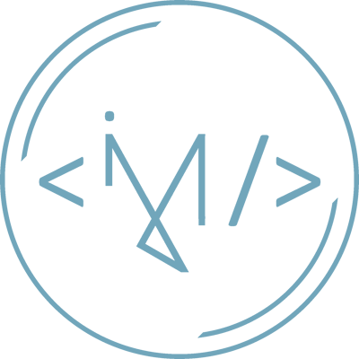

# V2 Jumic

## Description
Second version of my personal website.
This repository hosts the frontend, built with Angular. The site is available in both French and English, and the design is optimized for screens ranging from 300 to 3000px.
The backend is built with Express and Node.Js and is hosted on an another [repository](https://github.com/Jumic14/v2.jumic-back).

## Deployment
- **Frontend Application:** Deployed with [Vercel](https://vercel.com/)
- **Backend:** Deployed with [Render](https://render.com/)
- **Database:** Hosted with [MongoDB Atlas](https://www.mongodb.com/atlas)

## Credits
The design of this website was inspired by the work of [Brittany Chiang](https://github.com/bchiang7/v4), with Angular adaptation done by [José Hernández](https://github.com/andresjosehr/andresjosehr-portfolio). 

